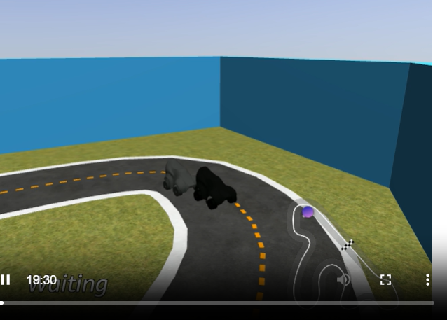

# AWS DeepRacer

## Introdução

Buscando entender mais sobre o desenvolvimento robusto por trás dos algoritmos de Machine Learning e IA, me aventurei em estudar mais sobre aprendizado por reforço. Com isso, encontrei uma ferramenta muito interessante da AWS voltada a testar modelos de machine learning utilizando simulações de corrida, onde os veículos (agentes) são treinados com base no aprendizado por reforço. Abaixo, descrevo todo meu processo com o DeepRacer, bem como minhas simulações e entendimento a respeito dos modelos de reforço. Estudei um pouco também a parte matemática de cada um, porém não me arriscarei a entrar nesse tema aqui. Indico, porém, que quem se interessar busque materiais a respeito das equações e teorias matemáticas de cada algoritmo – não é difícil encontrar bons materiais.

## Conhecendo AWS DeepRacer

O **AWS DeepRacer** é um simulador 3D de corrida em escala 1/18 baseado em nuvem, com princípios de Machine Learning focado no **aprendizado por reforço** dentro do sistema AWS. A própria AWS informa que desenvolvedores de todos os níveis podem colocar a mão na massa com o **DeepRacer**.

É possível **treinar e avaliar modelos de aprendizado por reforço profundo em simulações** e, depois, implantá-los em um veículo AWS DeepRacer para condução autônoma.

Um diferencial é poder participar da **AWS DeepRacer League**, que ocorre desde 2018. Mais de **560.000** construtores testaram seus conhecimentos e os ampliaram na plataforma de ML. Os principais modelos utilizados no processo são o PPO e o SAC, os quais abordarei a seguir.

## O que é PPO? (Proximal Policy Optimization)

Imagine que você está treinando um cachorro para dar a pata. Se você recompensá-lo demais de uma vez, ele pode ficar confuso ou animado demais e parar de obedecer. Se não recompensar o suficiente, ele não aprende. O PPO é como um treinador inteligente que dosa certinho as recompensas para que o aprendizado seja estável e eficiente.

Em termos técnicos, o PPO é um algoritmo de **aprendizado por reforço** que ajusta gradualmente o comportamento de um agente (como um robô ou um personagem em um jogo) para maximizar recompensas. Ou seja, o sistema de recompensa tem grande peso na evolução do agente.

### Por que o PPO foi criado?

- Resumidamente, nos algoritmos antigos, as atualizações podiam ser muito “bruscas”. Às vezes, uma grande mudança nos parâmetros fazia o agente piorar drasticamente e nunca mais recuperar o desempenho. O PPO evita isso, garantindo que as atualizações sejam **suaves e controladas**.

### Foco principal: A “razão” entre políticas

O PPO compara a política nova com a política antiga usando uma **razão**. Basicamente, o algoritmo usa a razão entre a política atual e a política antiga e mantém essa razão entre [1 - ε, 1 + ε].

Resumindo:

- Se a razão for próxima de 1, significa que a nova política é parecida com a antiga.
- Se for maior que 1, a ação ficou mais provável.
- Se for menor que 1, a ação ficou menos provável.

Se essa razão ficar muito grande ou muito pequena, o PPO “corta” (função *clip*) o valor para dentro de um intervalo seguro (ex: entre 0,8 e 1,2). Isso evita mudanças radicais e é um dos motivos pelo qual o aprendizado funciona de maneira menos drástica.

A função *clip* é definida como:

    L_clip(θ) = E_t[min(r_t(θ) * A_t, clip(r_t(θ), 1 - ε, 1 + ε) * A_t)]

                    r_t(θ) = π_θ(a_t|s_t) / π_old(a_t|s_t)

**Resumindo a função CLIP – a chave do PPO:**

- Impede que a política mude muito rápido.
- Só permite atualizações que mantenham a razão dentro de um limite seguro.
- Isso torna o treinamento mais estável e confiável.

### Fundamentos: Arquitetura Actor-Critic

O PPO usa dois agentes trabalhando juntos:

**Actor (Ator)**

- É quem age no ambiente.
- Gera episódios (sequências de ações e estados) usando a política atual.

**Critic (Crítico)**

- Avalia se as ações do Actor foram boas ou ruins.
- Calcula uma “vantagem”, ou seja, o quanto uma ação foi melhor ou pior do que o esperado.

Eles trabalham em paralelo: o Actor age, o Critic avalia, e juntos melhoram a política com base em princípios matemáticos.

### Hiperparâmetros do PPO (Os “botões de ajuste”)

- **ε (épsilon):** Controla o tamanho do “intervalo de segurança” para as atualizações. Valor típico: 0,2.
- **α (alpha):** Taxa de aprendizado – o quanto o modelo aprende por vez.
- **γ (gama):** Quanto o agente valoriza recompensas futuras. Valores próximos de 1 = pensamento a longo prazo.
- **K:** Número de épocas de treinamento por lote.
- **M:** Tamanho do minibatch (subconjunto de dados para treino rápido).
- **N:** Número de atores em paralelo.

## O que é SAC? (Soft Actor-Critic)

Imagine que você está explorando um labirinto. Se só repetir o caminho que já conhece, nunca vai encontrar uma saída melhor. Mas se explorar demais, pode se perder. O SAC é como um explorador inteligente que aprende com tentativas, mas também valoriza a exploração controlada. Ele não só maximiza recompensas, mas também tenta manter um comportamento “surpreendente” (entropia alta) para descobrir novas estratégias.

Em termos técnicos, o SAC é um algoritmo de aprendizado por reforço que combina aprendizado por valor e política, com foco especial em exploração eficiente e estabilidade.

**Por que o SAC foi criado?**

- Alguns algoritmos são muito “conservadores” e não exploram o suficiente.
- Outros exploram demais e demoram para convergir.
- O SAC acha um equilíbrio: explora o ambiente de forma inteligente enquanto aprende de maneira estável.

### Fundamental: Entropia e Exploração

O SAC introduz o conceito de **entropia**, que mede o nível de desordem ou incerteza em um sistema.

- Alta entropia = o agente explora mais (tenta ações novas).
- Baixa entropia = o agente é mais conservador (repetitivo).

O SAC incentiva alta entropia, ou seja, ele é naturalmente curioso. Isso ajuda a evitar que o agente fique preso em soluções ruins.

### Arquitetura: Actor-Critic com 2 Críticos

O SAC usa:

**Ator (Actor)**

- Decide quais ações tomar.
- Sua política é treinada para maximizar recompensas e entropia.

**Dois Críticos (Two Critics)**

- Avaliam o valor das ações.
- Usar dois críticos ajuda a evitar superestimativas – tornando o aprendizado mais estável.

**Alvo (Target)**

- Uma rede neural adicional que é atualizada lentamente para dar mais estabilidade ao treinamento.

### Hiperparâmetros do SAC (Os “botões de ajuste”)

- **α (alpha):** Peso da entropia. Controla o quanto o agente explora.
- **γ (gama):** Fator de desconto – importância de recompensas futuras.
- **τ (tau):** Velocidade de atualização da rede alvo (valores baixos = mais estabilidade).
- **Learning rate:** Taxa de aprendizado para as redes.
- **Batch size:** Tamanho do lote de treinamento.

## Ambiente do AWS DeepRacer

Dentro do DeepRacer, você é introduzido ao tema de aprendizado por reforço. Existe a possibilidade de realizar um treinamento da AWS sobre o tema ou simplesmente iniciar seu modelo.


---

O primeiro passo significativo é a seleção do ambiente – basicamente um percurso (pista) no qual seu modelo será treinado. Cada ambiente apresenta particularidades e dificuldades. Eu optei pela pista de 2022 (*2022 re:invent Championship*), oficial do torneio de 2022. Também é possível selecionar a direção do agente (veículo): horário ou anti-horário.


---

Na próxima tela, as escolhas são do tipo de corrida. Existem 3 opções:

1.  **Time trial:** O agente (veículo) corre contra o relógio, sem objetos ou adversários.
2.  **Object avoidance:** O agente corre em uma pista de duas faixas, contra objetos fixos ou randomizados. É possível selecionar a quantidade e posição dos objetos (caixas).
3.  **Head-to-head:** O agente corre contra outro veículo em movimento. Você pode escolher a quantidade de veículos, a velocidade constante de cada um e a frequência de troca de faixa.


---

Em minhas simulações, escolhi a terceira opção: corrida contra outro veículo.

E por fim a ultima as ultimas escolhas dessa etapa são,  algoritmo que será utilizado em seu modelo, conforme ja abordado acima, as opções são PPO e SAC. E por fim os hiperparametros que podem ser personalizados, ou não. Eu optei em seguir com os mesmos valores default (afinal não sou um expert em tunning de modelos). 

---


---


---

A próxima etapa é a seleção do **espaço de ação** (*Action space*), que pode ser contínuo ou discreto.

---


---

### Espaço de Ação Contínuo (Continuous Action Space)

- **O que é:** O agente pode escolher ações em um intervalo contínuo de valores.
- **Exemplos:** Acelerar um carro (ex: 0.0 a 100.0 km/h), girar um volante (ex: -90° a +90°), controlar torque de um motor.
- **Característica:** As ações são valores reais (números decimais).

### Espaço de Ação Discreto (Discrete Action Space)

- **O que é:** O agente escolhe entre um número finito de ações específicas.
- **Exemplos:** Jogos como xadrez (mover peça A para B), Atari (cima, baixo, esquerda, direita), selecionar uma opção em um menu.
- **Característica:** As ações são categorias ou opções distintas.

### Diferenças Principais:

| Característica       | Continuous                  | Discrete                    |
|----------------------|-----------------------------|-----------------------------|
| Tipo de ação         | Valores contínuos (ex: 0.75)| Opções fixas (ex: “esquerda”)|
| Complexidade         | Geralmente mais complexo    | Geralmente mais simples     |
| Algoritmos comuns    | SAC, PPO, DDPG              | DQN, A2C, PPO (com adaptação)|

**OBS:** O próprio site da AWS tem definições e comparações entre os tipos de espaço de ação. É interessante ler todo o material disponibilizado por eles (referências no final).

### Escolha do Veículo

Há uma camera frontal no veiculo (agente) representando o algoritmo de CNN (Convolutional Neural Network) em 3 layers. Rede Neural Convolucional é um tipo de rede neural profundamente especializada em processar dados com uma estrutura de grade, como imagens. Devido a isso a imagem na parte frontal do agente. Podemos ver o “veiculo” na imagem abaixo.

---


---

## Função de Recompensa

Conforme a definição da AWS, a função de recompensa descreve um feedback imediato (como uma pontuação para recompensa ou penalidade) quando o veículo realiza uma ação para se mover de uma posição na pista para outra. Ela vem pré-definida, mas pode ser editada ou substituída por uma função personalizada. Utilizei a função *default*:

```python
def reward_function(params):
    """
    Example of rewarding the agent to stay inside two borders
    and penalizing getting too close to the objects in front
    """
    all_wheels_on_track = params['all_wheels_on_track']
    distance_from_center = params['distance_from_center']
    track_width = params['track_width']
    objects_distance = params['objects_distance']
    next_object_index = params['closest_objects'][0]
    objects_left_of_center = params['objects_left_of_center']
    is_left_of_center = params['is_left_of_center']

    # Initialize reward with a small number but not zero
    # because zero means off-track or crashed
    reward = 1e-3

    # Reward if the agent stays inside the two borders of the track
    if all_wheels_on_track and (0.5 * track_width - distance_from_center) >= 0.05:
        reward_lane = 1.0
    else:
        reward_lane = 1e-3

    # Penalize if the agent is too close to the next object
    reward_avoid = 1.0

    # Distance to the next object
    distance_closest_object = objects_distance[next_object_index]
    # Decide if the agent and the next object is on the same lane
    is_same_lane = objects_left_of_center[next_object_index] == is_left_of_center

    if is_same_lane:
        if 0.5 <= distance_closest_object < 0.8:
            reward_avoid *= 0.5
        elif 0.3 <= distance_closest_object < 0.5:
            reward_avoid *= 0.2
        elif distance_closest_object < 0.3:
            reward_avoid = 1e-3  # Likely crashed

    # Calculate reward by putting different weights on
    # the two aspects above
    reward += 1.0 * reward_lane + 4.0 * reward_avoid

    return reward
```

**OBS**: Caso deseje, você pode submeter seu modelo para a competição, no momento em que estava realizando o experimento era o Open Practice 2025. Consequentemente você também poderá submete-lo para a liga oficial da DeepRacer.

---


---

### Treinamento e Avaliação

Com seu modelo criado a tela a seguir será a abaixo. Este é o processo de treinamento do modelo, ao finalizar você poderá alterar para aba avaliação e avaliar seu modelo.

---


---

Para este experimento eu realizei a criação de dois modelos, utilizando cada um com um algoritmo (**PPO** e **SAC**) utilizando Epaço Continuo. Abaixo estão os modelos (**DeepRacerTest-PPO** e **DeepRacer-Test-SAC**).

--- 


---

OBS: Um dos pontos mais interessantes do processo de treinamento é poder acompanhar pela virtualização 3d do treinamento e acompanhar a evolução (tentativas e erros). 

---



---

Conforme o treinamento vai avançando (utilizei o tempo de 60 minutos, este é um parâmetro que pode ser alterado, o treinamento pode ser maior ou menor). É apresentado um gráfico de resultado, este resultado aborda algumas variáveis do treinamento.

Referente ao tempo menos que 60 minutos não é indicado, por não ser suficiente. Utilizei apenas 60 minutos para fins de teste, porém um dos pontos que identifiquei é que um pouco mais de treinamento teria tido resultados um poucos melhores.


Com o andamento este grafico é preenchido com alguns benchmarks retirados dos dados de treinamento. Segundo o proprio material da AWS. 

> Você pode escolher visualizar a recompensa recebida por episódio, a recompensa média por iteração, o progresso por episódio, o progresso médio por iteração ou qualquer combinação deles. Para isso, alterne os botões "Recompensa (Episódio, Média)" ou "Progresso (Episódio, Média)" na parte inferior do gráfico de recompensas. A recompensa e o progresso por episódio são exibidos como gráficos dispersos em cores diferentes. A recompensa média e a conclusão da trilha são exibidas por gráficos de linhas e começam após a primeira iteração.
>


## Análise Comparativa: PPO vs SAC - Teste DeepRacer

Abaixo estão os dados (já organizados em tabela de cada um dos modelos)estes resultados podem ser baixados após o treinamento e também a avaliação.

**Modelo PPO**

| **Trial** | **Completion (%)** | **Tempo (ms)** | **Crash Count** | **Off Track Count** | **Reset Count** | **Status** |
| --- | --- | --- | --- | --- | --- | --- |
| 1 | 100 | 72,196 | 1 | 10 | 11 | Lap complete |
| 2 | 100 | 70,743 | 1 | 10 | 11 | Lap complete |
| 3 | 100 | 79,061 | 2 | 11 | 13 | Lap complete |
| **Média** | **100** | **74,000** | **1.3** | **10.3** | **11.7** |  |

**Modelo SAC**

| **Trial** | **Completion (%)** | **Tempo (ms)** | **Crash Count** | **Off Track Count** | **Reset Count** | **Status** |
| --- | --- | --- | --- | --- | --- | --- |
| 1 | 100 | 60,962 | 3 | 5 | 8 | Volta completa|
| 2 | 100 | 53,204 | 1 | 6 | 7 | Volta completa |
| 3 | 100 | 53,802 | 1 | 6 | 7 | Volta completa |
| **Média** | **100** | **55,989** | **1.7** | **5.7** | **7.3** |  |

### Analíse de desempenho geral

| **Métrica** | **PPO** | **SAC** | **Melhores resultados** |
| --- | --- | --- | --- |
| **Tempo Médio** | 74,000 ms | 55,989 ms | SAC |
| **Off Track Count** | 10.3 | 5.7 | SAC |
| **Reset Count** | 11.7 | 7.3 | SAC |

### Observações

**PPO (Proximal Policy Optimization):**

- Consegue completar voltas (100% completion)
- Maior número de saídas de pista (10.3 em média)
- Mais resets necessários (11.7 em média)
- Tempo médio mais alto (74s)
- Desempenho inconsistente entre trials

**SAC (Soft Actor-Critic):**

- Consegue completar voltas (100% completion)
- Menos saídas de pista (5.7 em média)
- Menos resets necessários (7.3 em média)
- Tempo médio significativamente menor (56s - 24% mais rápido)
- Desempenho mais consistente entre trials
- Levemente mais crashes no primeiro trial

## Conclusão Final do Experimento

Foi extremamente interessante experimentar o universo do DeepRacer, e com ele consegue explorar alguns pontos como os algoritmos, seus principios base, seus parametros e utilidade além de como eles são empregados no universo da simulação. Consegui colocar meus dois modelos de teste a prova e comparar os dados obtidos de cada um em suas respectivas runs. Por fim o que constantei foi que o **modelo SAC** demonstrou desempenho superior ao **modelo PPO** em praticamente todas as métricas:

1. **Tempo 24% mais rápido** para completar a volta
2. **45% menos saídas de pista**
3. **38% menos resets necessários**
4. **Maior consistência** entre diferentes trials

O modelo com algoritmo SAC em minha simulação, mostrou melhor capacidade de permanecer na pista e navegar de forma mais eficiente, resultando em tempos de volta significativamente melhores. A arquitetura do SAC, que combina maximização de recompensa com maximização de entropia, parece ser mais eficaz para este ambiente de corrida.

Reintero que utilizei a maioria dos parametros default, não personalizei os hiperparametros e nem a função de recompensa que são primordiais para se ter diferentes tipos/melhores resultados. Também não sou expecialista em Machine Learning (este o motivo de me aventurar com essa ferramenta), portanto estes resultados não podem ser tomados como definitivos ou que um modelo é melhor que outro de forma absoluta. 

E por fim gostaria de informar que os testes foram realizados no free-tier da AWS, portanto o tempo de treinamento e avaliação são limitados e com certeza tendo maior tempo de expermientação tanto quanto personalização, os modelos teriam resultados ainda mais impressioantes, todavia os resultados que tive bem como a experiencia da simulação, eu como amante de vide-games indico para todos aqueles que tem curiosidade sobre o mundo de Machine Learning. 

## Referências

- Schulman et al. (2017): Artigo original do PPO.
- Hugging Face, 2025.  Disponivel em(https://huggingface.co/docs/trl/main/ppo_trainer)(29/08/2025).
- Haarnoja et al. (2018): Artigo original do SAC.
- Stable Basiline Docs, 2025. Disponivel em https://stable-baselines3.readthedocs.io/en/master/modules/sac.html (29/08/2025).
- Train your first AWS DeepRacer model, 2025. Disponivel em: https://docs.aws.amazon.com/deepracer/latest/developerguide/deepracer-how-it-works-reinforcement-learning-algorithm.html (29/08/2025).
- AWS DeepRacer solution workflow, 2025. https://docs.aws.amazon.com/deepracer/latest/developerguide/deepracer-how-it-works-solution-workflow.html (29/08/2025).

# Introduction-to-Relational-Databases-RDBMS

